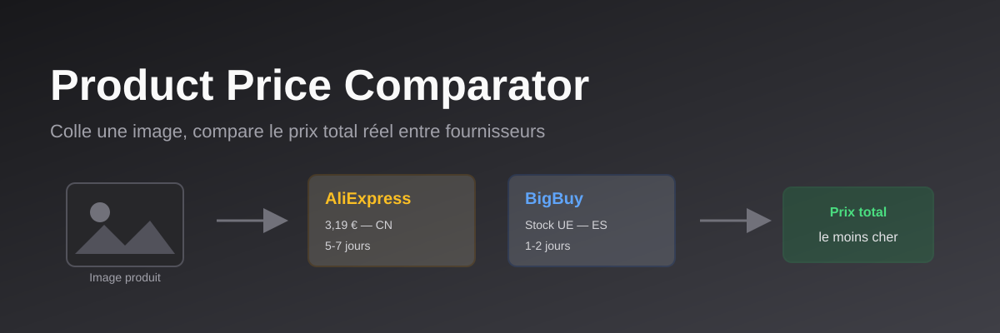

# Comparateur produit — MVP (AliExpress + BigBuy + CJdropshipping)



Colle une image (ou tape un texte) et retrouve le produit avec un prix total
estimé (produit + port + douane probable) comparé entre AliExpress, BigBuy
et CJdropshipping.

## État actuel

- **AliExpress**: intégration via une API tierce non-officielle (RapidAPI),
  choisie volontairement pour éviter la vérification d'identité (passeport/CNI)
  exigée par le programme AliExpress Affiliate officiel.
- **CJdropshipping**: intégration via l'API officielle gratuite. Prix en USD,
  convertis en EUR avec un taux approximatif fixe (pas de taux temps réel
  dans ce MVP) pour rester comparables aux autres offres.
- **BigBuy**: adaptateur prêt à l'emploi mais avec **données mockées** —
  l'API officielle BigBuy nécessite le Pack E-commerce payant (89€/mois).
  Renseigner `BIGBUY_API_KEY` dans `.env.local` active l'appel réel.
- **Identification image**: Google Cloud Vision (Web Detection), gratuit
  jusqu'à 1000 requêtes/mois.

## Configuration

```bash
cp .env.example .env.local
```

Puis renseigner:
- `GOOGLE_VISION_API_KEY` — https://console.cloud.google.com/apis/credentials
- `RAPIDAPI_KEY` + `RAPIDAPI_ALIEXPRESS_HOST` — choisir une API AliExpress
  avec tier gratuit sur https://rapidapi.com/collection/aliexpress-api
- `CJDROPSHIPPING_API_KEY` — compte gratuit sur cjdropshipping.com, puis
  app "API" > centre d'autorisation > "Add API" (type "API Key")
- `BIGBUY_API_KEY` — optionnel, laisser vide pour rester en mode mocké

## Lancer en local

```bash
npm run dev
```

Ouvrir http://localhost:3000. Pour tester sans consommer le quota Vision API,
utiliser le champ de recherche texte plutôt que l'upload d'image.

## Structure

- `lib/vision.ts` — identification produit par image (Google Vision)
- `lib/aliexpress.ts` — recherche AliExpress (API tierce RapidAPI)
- `lib/cjdropshipping.ts` — recherche CJdropshipping (API officielle, token en cache)
- `lib/bigbuy.ts` — recherche BigBuy (mocké tant que le pack payant n'est pas activé)
- `lib/pricing.ts` — calcul du prix total estimé (TVA/douane FR/UE 2026, conversion EUR)
- `app/api/search/route.ts` — orchestration: image → mots-clés → recherche multi-fournisseurs → tri par prix total
- `app/page.tsx` — UI de recherche et résultats

## Prochaines étapes possibles

- Ajouter Eprolo comme quatrième source (entrepôts UK/FR/IT)
- Taux de change EUR/USD en temps réel plutôt qu'un taux fixe approximatif
- Filtrer CJdropshipping sur le stock en entrepôt UE (`countryCode`) plutôt
  que d'afficher tout le catalogue comme origine Chine
- Cache Redis pour éviter de repayer une identification d'image déjà vue
- Matching/déduplication d'un même produit entre plusieurs offres
